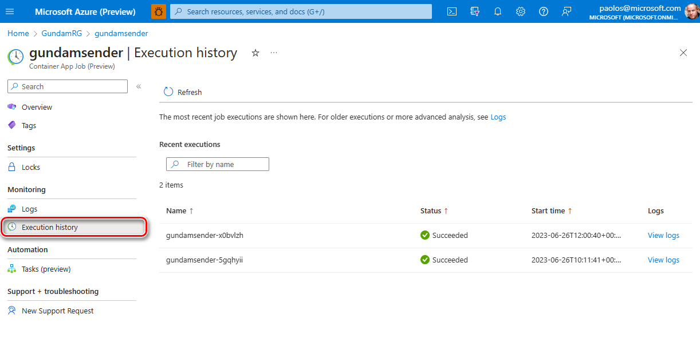

# Azure Container Apps Jobs Sample

This sample shows how to create [Azure Container Apps Jobs](https://learn.microsoft.com/en-us/azure/container-apps/jobs?tabs=azure-cli) via [Bicep](https://docs.microsoft.com/en-us/azure/azure-resource-manager/bicep/overview) or [Azure CLI](https://learn.microsoft.com/en-us/cli/azure/install-azure-cli), how to start jobs using [Azure CLI commands](https://learn.microsoft.com/en-us/cli/azure/containerapp/job?view=azure-cli-latest), and finally, how to monitor jobs using [Azure Monitor Log Analytics](https://learn.microsoft.com/en-us/azure/container-apps/observability).

## Prerequisites

- An active [Azure subscription](https://docs.microsoft.com/en-us/azure/guides/developer/azure-developer-guide#understanding-accounts-subscriptions-and-billing). If you don't have one, create a [free Azure account](https://azure.microsoft.com/free/) before you begin.
- [Visual Studio Code](https://code.visualstudio.com/) installed on one of the [supported platforms](https://code.visualstudio.com/docs/supporting/requirements#_platforms) along with the [Bicep extension](https://marketplace.visualstudio.com/items?itemName=ms-azuretools.vscode-bicep).
- Azure CLI version 2.49.0 or later installed. To install or upgrade, see [Install Azure CLI](https://learn.microsoft.com/en-us/cli/azure/install-azure-cli).
- `aks-preview` Azure CLI extension of version 0.5.140 or later installed

## Architecture

The following diagram shows the architecture and network topology of the sample:


This sample provides two sets of Bicep modules to deploy, respectively, the infrastructure and the jobs. In particular, you can use these Bicep modules in the `bicep/infra` folder to deploy the infrastructure used by the sample, including the [Azure Container Apps Environment](https://learn.microsoft.com/en-us/azure/container-apps/environment) and [Azure Container Registry (ACR)](https://learn.microsoft.com/en-us/azure/container-registry/container-registry-intro), but not the [Azure Container Apps Jobs](https://learn.microsoft.com/en-us/azure/container-apps/jobs?tabs=azure-cli).

- [Microsoft.Network/virtualNetworks](https://docs.microsoft.com/en-us/azure/templates/microsoft.network/virtualnetworks): an [Azure Virtual Network](https://learn.microsoft.com/en-us/azure/virtual-network/virtual-networks-overview) with two subnets:
  - `InfrastructureSubnet`: this subnet hosts the [Azure Container Apps Environment](https://learn.microsoft.com/en-us/azure/container-apps/environment).
  - `PrivateSubnet`: this subnet contains the [Azure Private Endpoints](https://docs.microsoft.com/en-us/azure/private-link/private-endpoint-overview).
- [Microsoft.App/managedEnvironments](https://learn.microsoft.com/en-us/azure/templates/microsoft.app/managedenvironments?pivots=deployment-language-bicep): the [Azure Container Apps Environment](https://learn.microsoft.com/en-us/azure/container-apps/environment) hosting the [Azure Container Apps Jobs](https://learn.microsoft.com/en-us/azure/container-apps/jobs?tabs=azure-cli).
- [Microsoft.ContainerRegistry/registries](https://learn.microsoft.com/en-us/azure/templates/microsoft.containerregistry/registries?pivots=deployment-language-bicep): an [Azure Container Registry (ACR)](https://learn.microsoft.com/en-us/azure/container-registry/container-registry-intro) to build, store, and manage jobs container images.
- [Microsoft.ServiceBus/namespaces](https://learn.microsoft.com/en-us/azure/templates/microsoft.servicebus/namespaces?pivots=deployment-language-bicep): an [Azure Service Bus](https://learn.microsoft.com/en-us/azure/service-bus-messaging/service-bus-messaging-overview) namespace and two queues, respectively, for parameters and results.
- [Microsoft.ManagedIdentity/userAssignedIdentities](https://learn.microsoft.com/en-us/azure/templates/microsoft.managedidentity/2018-11-30/userassignedidentities?pivots=deployment-language-bicep): a user-defined managed identity used by the AKS cluster to create additional resources like load balancers and managed disks in Azure.
- [Microsoft.ManagedIdentity/userAssignedIdentities](https://learn.microsoft.com/en-us/azure/templates/microsoft.managedidentity/2018-11-30/userassignedidentities?pivots=deployment-language-bicep): a user-defined managed identity used by the [Azure Container Apps Jobs](https://learn.microsoft.com/en-us/azure/container-apps/jobs?tabs=azure-cli) to pull container images from the [Azure Container Registry](https://learn.microsoft.com/en-us/azure/container-registry/container-registry-intro), and by the jobs to connect to the [Azure Service Bus](https://learn.microsoft.com/en-us/azure/service-bus-messaging/service-bus-messaging-overview) namespace. You can use a system-assigned or user-assigned managed identity from [Azure Active Directory (Azure AD)](https://learn.microsoft.com/en-us/azure/active-directory/fundamentals/active-directory-whatis) to let [Azure Container Apps Jobs](https://learn.microsoft.com/en-us/azure/container-apps/jobs?tabs=azure-cli) access any Azure AD-protected resource. For more information, see [Managed identities in Azure Container Apps](https://learn.microsoft.com/en-us/azure/container-apps/managed-identity?tabs=portal%2Cdotnet). You can pull container images from private repositories in an [Azure Container Registry](https://learn.microsoft.com/en-us/azure/container-registry/container-registry-intro) using user-assigned or user-assigned managed identities for authentication to avoid the use of administrative credentials. For more information, see [Azure Container Apps image pull with managed identity](https://learn.microsoft.com/en-us/azure/container-apps/managed-identity-image-pull?tabs=azure-cli&pivots=azure-portal). This user-defined managed identity is assigned the [Azure Service Bus Data Owner](https://learn.microsoft.com/en-us/azure/service-bus-messaging/service-bus-managed-service-identity) role on the [Azure Service Bus](https://learn.microsoft.com/en-us/azure/service-bus-messaging/service-bus-messaging-overview) namespace and [ACRPull](https://learn.microsoft.com/en-us/azure/container-registry/container-registry-roles?tabs=azure-cli) role on the [Azure Container Registry (ACR)](https://learn.microsoft.com/en-us/azur e/container-registry/container-registry-intro).
- [Microsoft.Network/privateEndpoints](https://docs.microsoft.com/en-us/azure/templates/microsoft.network/privateendpoints): an [Azure Private Endpoint](https://docs.microsoft.com/en-us/azure/private-link/private-endpoint-overview) is created for each of the following resources:
  - [Azure Container Registry (ACR)](https://learn.microsoft.com/en-us/azure/container-registry/container-registry-intro)
  - [Azure Service Bus](https://learn.microsoft.com/en-us/azure/service-bus-messaging/service-bus-messaging-overview)
- [Microsoft.Network/privateDnsZones](https://docs.microsoft.com/en-us/azure/templates/microsoft.network/privatednszones): an [Azure Private DNS Zone](https://docs.microsoft.com/en-us/azure/dns/private-dns-overview) is created for each of the following resources:
  - [Azure Container Registry (ACR)](https://learn.microsoft.com/en-us/azure/container-registry/container-registry-intro)
  - [Azure Service Bus](https://learn.microsoft.com/en-us/azure/service-bus-messaging/service-bus-messaging-overview)
- [Microsoft.OperationalInsights/workspaces](https://docs.microsoft.com/en-us/azure/templates/microsoft.operationalinsights/workspaces): a centralized [Azure Log Analytics](https://docs.microsoft.com/en-us/azure/azure-monitor/logs/log-analytics-workspace-overview) workspace is used to collect the diagnostics logs and metrics from the following Azure resources and components:
  - [Azure Container Registry (ACR)](https://learn.microsoft.com/en-us/azure/container-registry/container-registry-intro)s
  - [Azure Service Bus](https://learn.microsoft.com/en-us/azure/service-bus-messaging/service-bus-messaging-overview)
  - [Azure Container Apps Jobs](https://learn.microsoft.com/en-us/azure/container-apps/jobs?tabs=azure-cli)
  - [Azure Virtual Network](https://learn.microsoft.com/en-us/azure/virtual-network/virtual-networks-overview)

You can use these Bicep modules in the `bicep/jobs` folder to deploy the [Azure Container Apps Jobs](https://learn.microsoft.com/en-us/azure/container-apps/jobs?tabs=azure-cli) using the Docker container images stored in the [Azure Container Registry](https://learn.microsoft.com/en-us/azure/container-registry/container-registry-intro) deployed at the previous step.

- [Microsoft.App/jobs](https://learn.microsoft.com/en-us/azure/templates/microsoft.app/jobs?pivots=deployment-language-bicep): this samples deploys the following jobs:
  - `Sender` job: this is a manually triggered job that sends a configurable amount of messages to the `parameters` queue in the [Azure Service Bus](https://learn.microsoft.com/en-us/azure/service-bus-messaging/service-bus-messaging-overview) namespace. The payload of each message contains a random positive integer number comprised in a configurable range.
  - `Processor` job: this is a scheduled job that reads the messages from the `parameters` queue in the [Azure Service Bus](https://learn.microsoft.com/en-us/azure/service-bus-messaging/service-bus-messaging-overview) namespace, calculates the [Fibonacci number](https://en.wikipedia.org/wiki/Fibonacci_sequence) for the actual parameter, and writes the result in the `results` queue in the same namespace.
  - `Receiver` job: this is an event-driven job which execution is triggered by each message in the `results` queue. The job reads the result and logs it.

The following diagram shows the message flow of the sample:


Here are the steps of the message flow:

1. A job administrator starts the `sender` job using the [az containerapp job start](https://learn.microsoft.com/en-us/cli/azure/containerapp/job?view=azure-cli-latest#az-containerapp-job-start) Azure CLI command.
2. The `sender` job writes a list of messages to the `parameters` queue, each containing a random positive integer within a pre-defined range.
3. The `processor` job reads the messages from the `parameters` queue
4. The `processor` job calculates the [Fibonacci number](https://en.wikipedia.org/wiki/Fibonacci_sequence) for the actual integer and writes the result in the `results` queue in the same namespace.
5. The `receiver` job reads the messages from the `results` queue.
6. The `receiver` job writes the results to the standard output that is logged to the [Azure Log Analytics](https://docs.microsoft.com/en-us/azure/azure-monitor/logs/log-analytics-workspace-overview) workspace.

## Azure Container Apps Jobs

[Azure Container Apps Jobs](https://learn.microsoft.com/en-us/azure/container-apps/jobs?tabs=azure-cli) jobs allow you to run containerized tasks that execute for a given duration and complete. You can use jobs to run tasks such as data processing, machine learning, or any scenario where on-demand processing is required. For more information, see the following tutorials:

- [Create a job with Azure Container Apps](https://learn.microsoft.com/en-us/azure/container-apps/jobs-get-started-cli?pivots=container-apps-job-manual): in this tutorial, you create a manual or scheduled job.
- [Deploy an event-driven job with Azure Container Apps](https://learn.microsoft.com/en-us/azure/container-apps/tutorial-event-driven-jobs): shows how to create a job whose execution is triggered by each message that is sent to an Azure Storage Queue.
- [Deploy self-hosted CI/CD runners and agents with Azure Container Apps jobs](https://learn.microsoft.com/en-us/azure/container-apps/tutorial-ci-cd-runners-jobs?tabs=bash&pivots=container-apps-jobs-self-hosted-ci-cd-github-actions) shows how to run a [GitHub Actions self-hosted runner](https://docs.github.com/en/actions/hosting-your-own-runners/managing-self-hosted-runners/about-self-hosted-runners) as an [event-driven Azure Container Apps Job](https://learn.microsoft.com/en-us/azure/container-apps/jobs#event-driven-jobs).

Azure Container apps and jobs run in the same environment, allowing them to share capabilities such as networking and logging.

In comparison to [Kubernetes Jobs](https://kubernetes.io/docs/concepts/workloads/controllers/job/), [Azure Container Apps Jobs](https://learn.microsoft.com/en-us/azure/container-apps/jobs?tabs=azure-cli) provide a simpler and more serverless experience. While both [Azure Container Apps Jobs](https://learn.microsoft.com/en-us/azure/container-apps/jobs?tabs=azure-cli) and [Kubernetes Jobs](https://kubernetes.io/docs/concepts/workloads/controllers/job/) are used to run containerized tasks for a finite duration, there are some key differences between them:

- **Environment**: [Azure Container Apps Jobs](https://learn.microsoft.com/en-us/azure/container-apps/jobs?tabs=azure-cli) and [Kubernetes Jobs](https://kubernetes.io/docs/concepts/workloads/controllers/job/) run in different environments. [Azure Container Apps Jobs](https://learn.microsoft.com/en-us/azure/container-apps/jobs?tabs=azure-cli) run within the Azure Container Apps service, which is powered by Kubernetes and other open-source technologies like [Dapr (Distributed Application Runtime)](https://dapr.io/) and [KEDA (Kubernetes-based Event Driven Autoscaling)](https://keda.sh/). On the other hand, [Kubernetes Jobs](https://kubernetes.io/docs/concepts/workloads/controllers/job/) run within a Kubernetes cluster managed by [Azure Kubernetes Service (AKS)](https://learn.microsoft.com/en-us/azure/aks/intro-kubernetes).
- **Trigger Types**: [Azure Container Apps Jobs](https://learn.microsoft.com/en-us/azure/container-apps/jobs?tabs=azure-cli) support three trigger types: manual, schedule, and event-driven. Manual jobs are triggered on-demand, scheduled jobs are triggered at specific times and can run repeatedly, and event-driven jobs are triggered by events such as a message arriving in a queue. In comparison, [Kubernetes Jobs](https://kubernetes.io/docs/concepts/workloads/controllers/job/) are primarily triggered manually or based on time schedules, while [Kubernetes CronJobs](https://kubernetes.io/docs/concepts/workloads/controllers/cron-jobs/) are meant for performing regularly scheduled actions such as backups, report generation, and so on. They run a job periodically on a given schedule, written in [Cron](https://en.wikipedia.org/wiki/Cron) format.
- **Resource Management**: [Azure Container Apps Jobs](https://learn.microsoft.com/en-us/azure/container-apps/jobs?tabs=azure-cli) are managed within the Azure Container Apps service, providing a fully managed experience by Azure. In contrast, [Kubernetes Jobs](https://kubernetes.io/docs/concepts/workloads/controllers/job/) within [Azure Kubernetes Service (AKS)](<https://learn.microsoft.com/en-us/azure/aks/intro-kubernetes> provide more control and flexibility, as they allow direct access to the Kubernetes API and support running any Kubernetes workload. The cluster configurations and operations are within the user's control and responsibility with AKS.
- **Scaling and Load Balancing**: [Azure Container Apps Jobs](https://learn.microsoft.com/en-us/azure/container-apps/jobs?tabs=azure-cli) support event-driven scaling and automatic scaling of HTTP traffic, including the ability to scale to zero when there is no traffic. On the other hand, [Kubernetes Jobs](https://kubernetes.io/docs/concepts/workloads/controllers/job/) in AKS require manual scaling or metric-based scaling and do not support scaling to zero natively. However, Kubernetes-based Event Driven Autoscaling (KEDA) can be used with AKS to achieve similar scaling capabilities.

In summary, [Azure Container Apps Jobs](https://learn.microsoft.com/en-us/azure/container-apps/jobs?tabs=azure-cli) provide a simpler and more serverless experience for running containerized tasks, with built-in support for event-driven scaling and the ability to scale to zero. On the other hand, [Kubernetes Jobs](https://kubernetes.io/docs/concepts/workloads/controllers/job/) within AKS offer more control and flexibility, allowing direct access to the Kubernetes API and supporting any Kubernetes workload.

## Job trigger types

A job's trigger type determines how the job is started. The following trigger types are available:

- **Manual**: Manual jobs are triggered on-demand.
- **Schedule**: Scheduled jobs are triggered at specific times and can run repeatedly.
- **Event**: Event-driven jobs are triggered by events such as a message arriving in a queue.

### Manual jobs

Manual jobs are triggered on-demand using the Azure CLI or a request to the Azure Resource Manager API.

Examples of manual jobs include:

- One time processing tasks such as migrating data from one system to another.
- An e-commerce site running as container app starts a job execution to process inventory when an order is placed.

To create a manual job, use the job type `Manual`. To create a manual job using the Azure CLI, use the [az containerapp job create](https://learn.microsoft.com/en-us/cli/azure/containerapp/job?view=azure-cli-latest#az-containerapp-job-create) command. The following example creates a manual job named `my-job` in a resource group named `my-resource-group` and a Container Apps environment named `my-environment`:

```bash
az containerapp job create \
    --name "my-job" \
    --resource-group "my-resource-group"  \
    --environment "my-environment" \
    --trigger-type "Manual" \
    --replica-timeout 1800 \
    --replica-retry-limit 1 \
    --replica-completion-count 1 \
    --parallelism 1 \
    --image "mcr.microsoft.com/k8se/quickstart-jobs:latest" \
    --cpu "0.25" --memory "0.5Gi"
```

### Scheduled jobs

[Azure Container Apps Jobs](https://learn.microsoft.com/en-us/azure/container-apps/jobs?tabs=azure-cli) use [Cron](https://en.wikipedia.org/wiki/Cron) expressions to define schedules. It supports the standard [cron](https://en.wikipedia.org/wiki/Cron) expression format with five fields for minute, hour, day of month, month, and day of week. The following are examples of cron expressions:

| Expression | Description |
|---|---|
| `0 */2 * * *` | Runs every two hours. |
| `0 0 * * *` | Runs every day at midnight. |
| `0 0 * * 0` | Runs every Sunday at midnight. |
| `0 0 1 * *` | Runs on the first day of every month at midnight. |

[Cron](https://en.wikipedia.org/wiki/Cron) expressions in scheduled jobs are evaluated in Universal Time Coordinated (UTC). To create a scheduled job, you can use the job type `Schedule`. To create a scheduled job using the Azure CLI, use the [az containerapp job create](https://learn.microsoft.com/en-us/cli/azure/containerapp/job?view=azure-cli-latest#az-containerapp-job-create) command. The following example creates a scheduled job named `my-job` in a resource group named `my-resource-group` and a Container Apps environment named `my-environment`:

```bash
az containerapp job create \
    --name "my-job" \
    --resource-group "my-resource-group"  \
    --environment "my-environment" \
    --trigger-type "Schedule" \
    --replica-timeout 1800 \
    --replica-retry-limit 1 \
    --replica-completion-count 1 \
    --parallelism 1 \
    --image "mcr.microsoft.com/k8se/quickstart-jobs:latest" \
    --cpu "0.25" --memory "0.5Gi" \
    --cron-expression "0 0 * * *"
```

### Event-driven jobs

Event-driven jobs are triggered by events from supported [custom scalers](https://learn.microsoft.com/en-us/azure/container-apps/scale-app#custom). Examples of event-driven jobs include:

- A job that runs when a new message is added to a queue, such as Azure Service Bus, Azure Event Hubs, Apache Kafka, or RabbitMQ.
- A self-hosted GitHub Actions runner or Azure DevOps agent that runs when a new job is queued in a workflow or pipeline.

Container apps and event-driven jobs use [KEDA](https://keda.sh/) scalers. They both evaluate scaling rules on a polling interval to measure the volume of events for an event source, but the way they use the results is different.

In an app, each replica continuously processes events and a scaling rule determines the number of replicas to run to meet demand. In event-driven jobs, each job typically processes a single event, and a scaling rule determines the number of jobs to run.

Use jobs when each event requires a new instance of the container with dedicated resources or needs to run for a long time. Event-driven jobs are conceptually similar to [KEDA scaling jobs](https://keda.sh/docs/latest/concepts/scaling-jobs/).

To create an event-driven job, use the job type `Event`. To create an event-driven job using the Azure CLI, use the [az containerapp job create](https://learn.microsoft.com/en-us/cli/azure/containerapp/job?view=azure-cli-latest#az-containerapp-job-create) command. The following example creates an event-driven job named `my-job` in a resource group named `my-resource-group` and a Container Apps environment named `my-environment`:

```bash
az containerapp job create \
    --name "my-job" \
    --resource-group "my-resource-group"  \
    --environment "my-environment" \
    --trigger-type "Event" \
    --replica-timeout 1800  \
    --replica-retry-limit 1 \
    --replica-completion-count 1 \
    --parallelism 1 \
    --image "docker.io/myuser/my-event-driven-job:latest" \
    --cpu "0.25" --memory "0.5Gi" \
    --min-executions "0" \
    --max-executions "10" \
    --scale-rule-name "queue" \
    --scale-rule-type "azure-queue" \
    --scale-rule-metadata "accountName=mystorage" "queueName=myqueue" "queueLength=1" \
    --scale-rule-auth "connection=connection-string-secret" \
    --secrets "connection-string-secret=<QUEUE_CONNECTION_STRING>"
```

## Deploy the Infrastructure

You can deploy the infrastructure and network topology using the Bicep modules in the `bicep/infra` folder using the `deploy.sh` Bash script in the same folder. Specify a value for the following parameters in the `deploy.sh` Bash script and `main.parameters.json` parameters file before deploying the Bicep modules.

- `prefix`: specifies a prefix for all the Azure resources.
- `authenticationType`: location for the resource group and Azure resources.

The following table contains the code from the `container-apps-environment.bicep` Bicep module used to deploy the [Azure Container Apps Environment](https://learn.microsoft.com/en-us/azure/container-apps/environment). For more information, see the documentation of the [Microsoft.App/managedEnvironments](https://learn.microsoft.com/en-us/azure/templates/microsoft.app/managedenvironments?pivots=deployment-language-bicep) resource type:

```bicep
// Parameters
@description('Specifies the name of the Azure Container Apps Environment.')
param name string

@description('Specifies the location.')
param location string = resourceGroup().location

@description('Specifies the resource tags.')
param tags object

@description('Specifies whether the environment only has an internal load balancer. These environments do not have a public static IP resource. They must provide infrastructureSubnetId if enabling this property')
param internal bool = false

@description('Specifies the IP range in CIDR notation assigned to the Docker bridge, network. Must not overlap with any other provided IP ranges.')
param dockerBridgeCidr string

@description('Specifies the IP range in CIDR notation that can be reserved for environment infrastructure IP addresses. Must not overlap with any other provided IP ranges.')
param platformReservedCidr string

@description('Specifies an IP address from the IP range defined by platformReservedCidr that will be reserved for the internal DNS server.')
param platformReservedDnsIP string

@description('Specifies whether the Azure Container Apps environment should be zone-redundant.')
param zoneRedundant bool = true

@description('Specifies the resource id of the infrastructure subnet.')
param infrastructureSubnetId string

@description('Specifies the name of the Log Analytics workspace.')
param workspaceName string

@description('Specifies the Azure Monitor instrumentation key used by Dapr to export Service to Service communication telemetry.')
param daprAIInstrumentationKey string = ''

@description('Specifies the configuration of Dapr component.')
param daprAIConnectionString string = ''

@description('Specifies the certificate password.')
@secure()
param certificatePassword string = ''

@description('Specifies the PFX or PEM certificate value.')
param certificateValue string = ''

@description('Specifies the DNS suffix for the environment domain.')
param dnsSuffix string = ''

@description('Specifies workload profiles configured for the Managed Environment.')
param workloadProfiles array = []

// Resources
resource logAnalyticsWorkspace 'Microsoft.OperationalInsights/workspaces@2021-12-01-preview' existing = {
  name: workspaceName
}

resource environment 'Microsoft.App/managedEnvironments@2023-04-01-preview' = {
  name: name
  location: location
  tags: tags
  properties: {
    customDomainConfiguration: empty(certificatePassword) && empty(certificateValue) && empty(dnsSuffix)? null : {
      certificatePassword: certificatePassword
      certificateValue: certificateValue
      dnsSuffix: dnsSuffix
    }
    daprAIInstrumentationKey: daprAIInstrumentationKey
    daprAIConnectionString: daprAIConnectionString
    vnetConfiguration: {
      internal: internal
      infrastructureSubnetId: infrastructureSubnetId
      dockerBridgeCidr: dockerBridgeCidr
      platformReservedCidr: platformReservedCidr
      platformReservedDnsIP: platformReservedDnsIP
    }
    appLogsConfiguration: {
      destination: 'log-analytics'
      logAnalyticsConfiguration: {
        customerId: logAnalyticsWorkspace.properties.customerId
        sharedKey: logAnalyticsWorkspace.listKeys().primarySharedKey
      }
    }
    zoneRedundant: zoneRedundant
    workloadProfiles: workloadProfiles
  }
}

// Outputs
output id string = environment.id
output name string = environment.name
output daprConfiguration object = environment.properties.daprConfiguration
output kedaConfiguration object = environment.properties.kedaConfiguration
output appLogsConfiguration object = environment.properties.appLogsConfiguration
```

The following table contains the code from the `managed-identity.bicep` Bicep module used to deploy the [Azure Managed Identity](https://learn.microsoft.com/en-us/azure/container-apps/managed-identity?tabs=arm%2Cpython) used by the by the [Azure Container Apps Jobs](https://learn.microsoft.com/en-us/azure/container-apps/jobs?tabs=azure-cli) to pull container images from the [Azure Container Registry](https://learn.microsoft.com/en-us/azure/container-registry/container-registry-intro), and by the jobs to connect to the [Azure Service Bus](https://learn.microsoft.com/en-us/azure/service-bus-messaging/service-bus-messaging-overview) namespace. You can use a system-assigned or user-assigned managed identity from [Azure Active Directory (Azure AD)](https://learn.microsoft.com/en-us/azure/active-directory/fundamentals/active-directory-whatis) to let [Azure Container Apps Jobs](https://learn.microsoft.com/en-us/azure/container-apps/jobs?tabs=azure-cli) access any Azure AD-protected resource. For more information, see [Managed identities in Azure Container Apps](https://learn.microsoft.com/en-us/azure/container-apps/managed-identity?tabs=portal%2Cdotnet). You can pull container images from private repositories in an [Azure Container Registry](https://learn.microsoft.com/en-us/azure/container-registry/container-registry-intro) using user-assigned or user-assigned managed identities for authentication to avoid the use of administrative credentials. For more information, see [Azure Container Apps image pull with managed identity](https://learn.microsoft.com/en-us/azure/container-apps/managed-identity-image-pull?tabs=azure-cli&pivots=azure-portal). This user-defined managed identity is assigned the [Azure Service Bus Data Owner](https://learn.microsoft.com/en-us/azure/service-bus-messaging/service-bus-managed-service-identity) role on the [Azure Service Bus](https://learn.microsoft.com/en-us/azure/service-bus-messaging/service-bus-messaging-overview) namespace and [ACRPull](https://learn.microsoft.com/en-us/azure/container-registry/container-registry-roles?tabs=azure-cli) role on the [Azure Container Registry (ACR)](https://learn.microsoft.com/en-us/azure/container-registry/container-registry-intro).

```bicep
// Parameters
@description('Specifies the name of the user-defined managed identity.')
param name string

@description('Specifies the name of the Service Bus namespace.')
param serviceBusNamespace string

@description('Specifies the name of the Azure Container Registry')
param acrName string

@description('Specifies the location.')
param location string = resourceGroup().location

@description('Specifies the resource tags.')
param tags object

// Variables
var serviceBusDataOwnerRoleDefinitionId = resourceId('Microsoft.Authorization/roleDefinitions', '090c5cfd-751d-490a-894a-3ce6f1109419')
var acrPullRoleDefinitionId = resourceId('Microsoft.Authorization/roleDefinitions', '7f951dda-4ed3-4680-a7ca-43fe172d538d')

// Existing Resources
resource namespace 'Microsoft.ServiceBus/namespaces@2022-10-01-preview' existing= {
  name: serviceBusNamespace
}

resource acr 'Microsoft.ContainerRegistry/registries@2023-01-01-preview' existing = {
  name: acrName
}

// Managed Identity
resource managedIdentity 'Microsoft.ManagedIdentity/userAssignedIdentities@2023-01-31' = {
  name: name
  location: location
  tags: tags
}

// Role assignments
resource serviceBusDataOwnerRoleAssignment 'Microsoft.Authorization/roleAssignments@2022-04-01' = {
  name:  guid(managedIdentity.id, namespace.id, serviceBusDataOwnerRoleDefinitionId)
  scope: namespace
  properties: {
    roleDefinitionId: serviceBusDataOwnerRoleDefinitionId
    principalId: managedIdentity.properties.principalId
    principalType: 'ServicePrincipal'
  }
}

resource acrPullRoleDefinitionAssignment 'Microsoft.Authorization/roleAssignments@2022-04-01' = {
  name:  guid(managedIdentity.id, acr.id, acrPullRoleDefinitionId)
  scope: acr
  properties: {
    roleDefinitionId: acrPullRoleDefinitionId
    principalId: managedIdentity.properties.principalId
    principalType: 'ServicePrincipal'
  }
}

// Outputs
output id string = managedIdentity.id
output name string = managedIdentity.name
output clientId string = managedIdentity.properties.clientId
output principalId string = managedIdentity.properties.principalId

```

## Jobs

You can find the Python code for the  `sender`, `processor`, and `receiver` [jobs](https://learn.microsoft.com/en-us/azure/container-apps/jobs?tabs=azure-cli) under the `src` folder. The three jobs makes use of the following libraries:

- [azure-servicebus](https://pypi.org/project/azure-servicebus/): you can use this Service Bus client library to let Python applications communicate with the [Azure Service Bus](https://learn.microsoft.com/en-us/azure/service-bus-messaging/service-bus-messaging-overview) implement asynchronous messaging patterns.
- [azure-identity](https://learn.microsoft.com/en-us/python/api/overview/azure/identity-readme?view=azure-python): The Azure Identity library provides [Azure Active Directory (Azure AD)](https://learn.microsoft.com/en-us/azure/active-directory/fundamentals/active-directory-whatis) token authentication support across the Azure SDK. It provides a set of [TokenCredential](https://learn.microsoft.com/en-us/python/api/azure-core/azure.core.credentials.tokencredential?view=azure-python) implementations, which can be used to construct Azure SDK clients that support Azure AD token authentication.
- [python-dotenv](https://github.com/theskumar/python-dotenv): Python-dotenv reads key-value pairs from a .env file and can set them as environment variables. It helps in the development of applications following the [12-factor](http://12factor.net/) principles.

The `requirements.txt` file under the `scripts` folder contains the list of packages used by the `app.py` application that you can restore using the following command:

```bash
pip install -r requirements.txt --upgrade
```

Each job makes use of a [DefaultAzureCredential](https://learn.microsoft.com/en-us/python/api/azure-identity/azure.identity.defaultazurecredential?view=azure-python) object to acquire a security token from Azure Active Directory and access the queues in the [Azure Service Bus](https://learn.microsoft.com/en-us/azure/service-bus-messaging/service-bus-messaging-overview) namespace using the credentials of the user-defined managed identity associated to the [Azure Container Apps Job](https://learn.microsoft.com/en-us/azure/container-apps/jobs?tabs=azure-cli).

You can use a managed identity in a running container app or job to authenticate to any [service that supports Azure AD authentication](https://learn.microsoft.com/en-us/azure/active-directory/managed-identities-azure-resources/services-support-managed-identities#azure-services-that-support-azure-ad-authentication).

With managed identities:

- Container apps and jobs connect to resources with the managed identity. You don't need to manage credentials in your container app or job.
- You can use role-based access control to grant specific permissions to a managed identity. In our sample, we granted the [Azure Service Bus Data Owner](https://learn.microsoft.com/en-us/azure/service-bus-messaging/service-bus-managed-service-identity) role on the [Azure Service Bus](https://learn.microsoft.com/en-us/azure/service-bus-messaging/service-bus-messaging-overview) namespace and [ACRPull](https://learn.microsoft.com/en-us/azure/container-registry/container-registry-roles?tabs=azure-cli) role on the [Azure Container Registry (ACR)](https://learn.microsoft.com/en-us/azure/container-registry/container-registry-intro) to the workload managed identity associated to the three jobs.
- System-assigned identities are automatically created and managed. They are deleted when your container app or job is deleted.
- You can add and delete user-assigned identities and assign them to multiple resources. They are independent of your container app or job's lifecycle.
- You can use managed identity to [authenticate with a private Azure Container Registry](https://learn.microsoft.com/en-us/azure/container-apps/containers#container-registries) without a username and password to pull containers for your Container App.
- You can use [managed identity to create connections for Dapr-enabled applications via Dapr components](https://learn.microsoft.com/en-us/azure/container-apps/dapr-overview)

If you want to debug the `sender`, `processor`, and `receiver` [jobs](https://learn.microsoft.com/en-us/azure/container-apps/jobs?tabs=azure-cli) locally, you can define a value for the environment variables in the `src/.env` file, the credentials used by the [DefaultAzureCredential](https://learn.microsoft.com/en-us/python/api/azure-identity/azure.identity.defaultazurecredential?view=azure-python) object in the `src/.local` file.

In the Azure Identity client libraries, you can choose one of the following approaches:

- Use `DefaultAzureCredential`, which will attempt to use the `WorkloadIdentityCredential`.
- Create a `ChainedTokenCredential` instance that includes `WorkloadIdentityCredential`.
- Use `WorkloadIdentityCredential` directly.

The following table provides the **minimum** package version required for each language's client library.

| Language   | Library                                                                                      | Minimum Version | Example                                                                                           |
|------------|----------------------------------------------------------------------------------------------|-----------------|---------------------------------------------------------------------------------------------------|
| .NET       | [Azure.Identity](/dotnet/api/overview/azure/identity-readme)      | 1.9.0    | [Link](https://github.com/Azure/azure-workload-identity/tree/main/examples/azure-identity/dotnet) |
| Go         | [azidentity](https://pkg.go.dev/github.com/Azure/azure-sdk-for-go/sdk/azidentity)            | 1.3.0    | [Link](https://github.com/Azure/azure-workload-identity/tree/main/examples/azure-identity/go)     |
| Java       | [azure-identity](/java/api/overview/azure/identity-readme)        | 1.9.0    | [Link](https://github.com/Azure/azure-workload-identity/tree/main/examples/azure-identity/java)   |
| JavaScript | [@azure/identity](/javascript/api/overview/azure/identity-readme) | 3.2.0    | [Link](https://github.com/Azure/azure-workload-identity/tree/main/examples/azure-identity/node)   |
| Python     | [azure-identity](/python/api/overview/azure/identity-readme)      | 1.13.0        | [Link](https://github.com/Azure/azure-workload-identity/tree/main/examples/azure-identity/python) |

When using Azure Identity client library with Azure Container Apps and Azure Container Apps Jobs, the user-assigned managed identity client id must be specified. 

### Sender Job

The `sender` task is a manually triggered job that sends a configurable amount of messages to the `parameters` queue in the [Azure Service Bus](https://learn.microsoft.com/en-us/azure/service-bus-messaging/service-bus-messaging-overview) namespace. The payload of each message contains a random positive integer number comprised in a configurable range. The Python code of the `sender` job is contained in a single file called `sbsender.py` under the `src` folder. You can configure the job using the following environment variables:

- `FULLY_QUALIFIED_NAMESPACE`: the fully qualified name of the [Azure Service Bus](https://learn.microsoft.com/en-us/azure/service-bus-messaging/service-bus-messaging-overview) namespace.
- `INPUT_QUEUE_NAME`: the name of the `parameters` queue to which the job sends request messages.
- `MIN_NUMBER`: the minimum value of the parameter.
- `MAX_NUMBER`: the maximum value of the parameter.
- `MESSAGE_COUNT`: the count of messages that the job sends to the `parameters` queue.
- `SEND_TYPE`: the `sender job` can send messages using the following approaches:
  - `list`: sends all the messages with a single call.
  - `batch`sends all the messages as a batch.

```python
import os
import asyncio
import random
from azure.servicebus.aio import ServiceBusClient
from azure.servicebus import ServiceBusMessage
from azure.identity.aio import DefaultAzureCredential
from dotenv import load_dotenv
from dotenv import dotenv_values

# Load environment variables from .env file
if os.path.exists(".env"):
  load_dotenv(override = True)
  config = dotenv_values(".env")

# Read environment variables
fully_qualified_namespace = os.getenv("FULLY_QUALIFIED_NAMESPACE")
queue_name = os.getenv("INPUT_QUEUE_NAME")
min_number = int(os.getenv("MIN_NUMBER", 1))
max_number = int(os.getenv("MAX_NUMBER", 10))
message_count = int(os.getenv("MESSAGE_COUNT", 100))
send_type = os.getenv("SEND_TYPE", "list")

# Print environment variables
print(f"FULLY_QUALIFIED_NAMESPACE: {fully_qualified_namespace}")
print(f"INPUT_QUEUE_NAME: {queue_name}")
print(f"MIN_NUMBER: {min_number}")
print(f"MAX_NUMBER: {max_number}")
print(f"MESSAGE_COUNT: {message_count}")
print(f"SEND_TYPE: {send_type}")

# Get credential object
credential = DefaultAzureCredential()

async def send_a_list_of_messages(sender):
  try:
    # Create a list of messages and send it to the queue
    messages = [ServiceBusMessage(f"{random.randint(min_number, max_number)}") for _ in range(message_count)]
    await sender.send_messages(messages)
    print(f"Sent a list of {message_count} messages to the {queue_name} queue")
  except Exception as e:
    print(f"An error occurred while sending a list of message to the {queue_name} queue: {e}")

async def send_batch_message(sender):
  # Create a batch of messages
  async with sender:
    batch_message = await sender.create_message_batch()
    for _ in range(message_count):
      try:
        # Add a message to the batch
        batch_message.add_message(ServiceBusMessage(f"{random.randint(min_number, max_number)}"))
      except Exception as e:
        print(f"An error occurred while creating a batch of messages: {e}")
        break
    # Send the batch of messages to the queue
    try:
      await sender.send_messages(batch_message)
      print(f"Sent a batch of {message_count} messages to the {queue_name} queue")
    except Exception as e:
      print(f"An error occurred while sending a batch of message to the {queue_name} queue: {e}")
  
async def run():
  # create a Service Bus client using the credential
  async with ServiceBusClient(
    fully_qualified_namespace = fully_qualified_namespace,
    credential = credential,
    logging_enable = False) as servicebus_client:
    # get a Queue Sender object to send messages to the queue
    sender = servicebus_client.get_queue_sender(queue_name = queue_name)
    async with sender:
      if send_type ==  "list":
        await send_a_list_of_messages(sender)
      elif send_type ==  "batch":
        await send_batch_message(sender)
      else:
        print(f"Invalid send type: {send_type}")

# Send messages to the input queue
asyncio.run(run())

# Close credential object when it's no longer needed
asyncio.run(credential.close())
```

### Processor Job

The `processor` task is a scheduled job that reads the messages from the `parameters` queue in the [Azure Service Bus](https://learn.microsoft.com/en-us/azure/service-bus-messaging/service-bus-messaging-overview) namespace, calculates the [Fibonacci number](https://en.wikipedia.org/wiki/Fibonacci_sequence) for the actual parameter, and writes the result in the `results` queue in the same namespace. The Python code of the `processor` job is contained in a single file called `sbprocessor.py` under the `src` folder. You can configure the job using the following environment variables:

- `FULLY_QUALIFIED_NAMESPACE`: the fully qualified name of the [Azure Service Bus](https://learn.microsoft.com/en-us/azure/service-bus-messaging/service-bus-messaging-overview) namespace.
- `INPUT_QUEUE_NAME`: the name of the `parameters` queue from which the job receives request messages.
- `OUTPUT_QUEUE_NAME`: the name of the `results` queue to which the job sends result messages.
- `MAX_MESSAGE_COUNT`: the maximum number of messages that each job run receives and processes from the `parameters` queue.
- `MAX_WAIT_TIME`: the maximum wait time in seconds for the message receive method.

```python
import os
import asyncio
from azure.servicebus.aio import ServiceBusClient
from azure.servicebus import ServiceBusMessage
from azure.identity.aio import DefaultAzureCredential
from dotenv import load_dotenv
from dotenv import dotenv_values

# Load environment variables from .env file
if os.path.exists(".env"):
  load_dotenv(override=True)
  config = dotenv_values(".env")

# Read environment variables
fully_qualified_namespace = os.getenv("FULLY_QUALIFIED_NAMESPACE")
input_queue_name = os.getenv("INPUT_QUEUE_NAME")
output_queue_name = os.getenv("OUTPUT_QUEUE_NAME")
max_message_count = int(os.getenv("MAX_MESSAGE_COUNT", 20))
max_wait_time = int(os.getenv("MAX_WAIT_TIME", 5))

# Print environment variables
print(f"FULLY_QUALIFIED_NAMESPACE: {fully_qualified_namespace}")
print(f"INPUT_QUEUE_NAME: {input_queue_name}")
print(f"OUTPUT_QUEUE_NAME: {output_queue_name}")
print(f"MAX_MESSAGE_COUNT: {max_message_count}")
print(f"MAX_WAIT_TIME: {max_wait_time}")

# Get credential object
credential = DefaultAzureCredential()

async def fibonacci(n):
  if n <= 0:
    raise ValueError("n must be a positive integer")
  elif n == 1:
    return 0
  elif n == 2:
    return 1
  else:
    fib1 = await fibonacci(n - 1)
    fib2 = await fibonacci(n - 2)
    return fib1 + fib2

async def send_message(message_text: str, i: int):
   # Check that the message is not empty
  if message_text:
    try:
      # Create a Service Bus client using the credential
      async with ServiceBusClient(
        fully_qualified_namespace = fully_qualified_namespace,
        credential = credential,
        logging_enable = True) as servicebus_client:
        # Get a Queue Sender object to send messages to the output queue
        sender = servicebus_client.get_queue_sender(queue_name = output_queue_name)
        async with sender:
          # Create a Service Bus message and send it to the queue
          message = ServiceBusMessage(message_text)
          # Send a message to the output queue
          await sender.send_messages(message)
          print(f"[{i}] Sent result message: {message_text}")
    except Exception as e:
      print(f"An error occurred while sending [{i}] message to the {output_queue_name} queue: {e}")
  else:
    print(f"The [{i}] message is empty. Please, enter a valid message.")

async def receive_messages():
  # create a Service Bus client using the connection string
  async with ServiceBusClient(
    fully_qualified_namespace = fully_qualified_namespace,
    credential = credential,
    logging_enable = False) as servicebus_client:

    async with servicebus_client:
      # Get the Queue Receiver object for the input queue
      receiver = servicebus_client.get_queue_receiver(queue_name = input_queue_name)
      async with receiver:
        try:
          received_msgs = await receiver.receive_messages(max_wait_time = max_wait_time, max_message_count = max_message_count)
          i = 0
          for msg in received_msgs:
            # Check if message contains an integer value
            try:
              n = int(str(msg))
              i += 1
              print(f"[{i}] Received Message: {n}")
              # Calculate Fibonacci number
              result = await fibonacci(n)
              print(f"[{i}] The Fibonacci number for {n} is {result}")
              # Send result to the output queue
              await send_message(str(result), i)
            except ValueError:
              print(f"[{i}] Received message {str(msg)} is not an integer number")
              continue
            finally:
              # Complete the message so that the message is removed from the queue
              await receiver.complete_message(msg)
              print(f"[{i}] Completed message: {str(msg)}")
        except Exception as e:
          print(f"An error occurred while receiving messages from the {input_queue_name} queue: {e}")

# Receive messages from the input queue
asyncio.run(receive_messages())

# Close credential object when it's no longer needed
asyncio.run(credential.close())
```

### Receiver Job

The `receiver` task is an event-driven job which execution is triggered by each message in the `results` queue. The job reads the result and logs it.  The Python code of the `receiver` job is contained in a single file called `sbreceiver.py` under the `src` folder. You can configure the job using the following environment variables:

- `FULLY_QUALIFIED_NAMESPACE`: the fully qualified name of the [Azure Service Bus](https://learn.microsoft.com/en-us/azure/service-bus-messaging/service-bus-messaging-overview) namespace.
- `OUTPUT_QUEUE_NAME`: the name of the `results` queue from which the job receives result messages.
- `MAX_MESSAGE_COUNT`: the maximum number of messages that each job run receives and processes from the `parameters` queue.
- `MAX_WAIT_TIME`: the maximum wait time in seconds for the message receive method.

```python
import os
import asyncio
from azure.servicebus.aio import ServiceBusClient
from azure.identity.aio import DefaultAzureCredential
from dotenv import load_dotenv
from dotenv import dotenv_values

# Load environment variables from .env file
if os.path.exists(".env"):
  load_dotenv(override=True)
  config = dotenv_values(".env")

# Read environment variables
fully_qualified_namespace = os.getenv("FULLY_QUALIFIED_NAMESPACE")
queue_name = os.getenv("OUTPUT_QUEUE_NAME")
max_message_count = int(os.getenv("MAX_MESSAGE_COUNT", 20))
max_wait_time = int(os.getenv("MAX_WAIT_TIME", 5))

# Print environment variables
print(f"FULLY_QUALIFIED_NAMESPACE: {fully_qualified_namespace}")
print(f"OUTPUT_QUEUE_NAME: {queue_name}")
print(f"MAX_MESSAGE_COUNT: {max_message_count}")
print(f"MAX_WAIT_TIME: {max_wait_time}")

# Get credential object
credential = DefaultAzureCredential()

async def receive_messages():
  # create a Service Bus client using the connection string
  async with ServiceBusClient(
    fully_qualified_namespace = fully_qualified_namespace,
    credential = credential,
    logging_enable = False) as servicebus_client:

    async with servicebus_client:
      # Get the Queue Receiver object for the input queue
      receiver = servicebus_client.get_queue_receiver(queue_name = queue_name)
      async with receiver:
        i = 0
        # Receive a batch of messages until the queue is empty
        while True:
          try:
            received_msgs = await receiver.receive_messages(max_wait_time = max_wait_time, max_message_count = max_message_count)
            if len(received_msgs) == 0:
              break
            for msg in received_msgs:
              # Check if message contains an integer value
              try:
                n = int(str(msg))
                i += 1
                print(f"[{i}] Received Message: {n}")
              except ValueError:
                print(f"[{i}] Received message {str(msg)} is not an integer number")
                continue
              finally:
                # Complete the message so that the message is removed from the queue
                await receiver.complete_message(msg)
                print(f"[{i}] Completed message: {str(msg)}")
          except Exception as e:
            print(f"An error occurred while receiving messages from the {queue_name} queue: {e}")
            break

# Receive messages from the input queue
asyncio.run(receive_messages())

# Close credential object when it's no longer needed
asyncio.run(credential.close())
```

## Build Docker Images

You can use the `01-build-docker-images.sh` Bash script in the `src` folder to build the Docker container image for each job.

```bash
#!/bin/bash

# Variables
source ./00-variables.sh

# Use a for loop to build the docker images using the array index
for index in ${!images[@]}; do
  # Build the docker image
  docker build -t ${images[$index]}:$tag -f Dockerfile --build-arg FILENAME=${filenames[$index]} .
done
```

Before running any script in the `src` folder, make sure to customize the value of the variables inside the `00-variables.sh` file located in the same folder. This file is embedded in all the scripts and contains the following variables:

```bash
# Variables
prefix="<your-prefix>"
acrName="${prefix}Acr"
acrResourceGrougName="${prefix}RG"
location="northeurope"
attachAcr=false
senderImageName="sbsender"
processorImageName="sbprocessor"
receiverImageName="sbreceiver"
images=($senderImageName $processorImageName $receiverImageName)
filenames=(sbsender.py sbprocessor.py sbreceiver.py)
tag="v1"

# Azure Subscription and Tenant
subscriptionId=$(az account show --query id --output tsv)
subscriptionName=$(az account show --query name --output tsv)
tenantId=$(az account show --query tenantId --output tsv)
```

The `Dockerfile` under the `src` folder is parametric and can be used to build the container images for three jobs.

```dockerfile
# app/Dockerfile

# # Stage 1 - Install build dependencies

# A Dockerfile must start with a FROM instruction which sets the base image for the container.
# The Python images come in many flavors, each designed for a specific use case.
# The python:3.11-slim image is a good base image for most applications.
# It is a minimal image built on top of Debian Linux and includes only the necessary packages to run Python.
# The slim image is a good choice because it is small and contains only the packages needed to run Python.
# For more information, see: 
# * https://hub.docker.com/_/python 
# * https://docs.streamlit.io/knowledge-base/tutorials/deploy/docker
FROM python:3.11-slim AS builder

# The WORKDIR instruction sets the working directory for any RUN, CMD, ENTRYPOINT, COPY and ADD instructions that follow it in the Dockerfile.
# If the WORKDIR doesnt exist, it will be created even if its not used in any subsequent Dockerfile instruction.
# For more information, see: https://docs.docker.com/engine/reference/builder/#workdir
WORKDIR /app

# Set environment variables. 
# The ENV instruction sets the environment variable <key> to the value <value>.
# This value will be in the environment of all descendant Dockerfile commands and can be replaced inline in many as well.
# For more information, see: https://docs.docker.com/engine/reference/builder/#env
ENV PYTHONDONTWRITEBYTECODE 1
ENV PYTHONUNBUFFERED 1

# Install git so that we can clone the app code from a remote repo using the RUN instruction.
# The RUN comand has 2 forms:
# * RUN <command> (shell form, the command is run in a shell, which by default is /bin/sh -c on Linux or cmd /S /C on Windows)
# * RUN ["executable", "param1", "param2"] (exec form)
# The RUN instruction will execute any commands in a new layer on top of the current image and commit the results. 
# The resulting committed image will be used for the next step in the Dockerfile.
# For more information, see: https://docs.docker.com/engine/reference/builder/#run
RUN apt-get update && apt-get install -y \
    build-essential \
    curl \
    software-properties-common \
    git \
    && rm -rf /var/lib/apt/lists/*

# Create a virtualenv to keep dependencies together
RUN python -m venv /opt/venv
ENV PATH="/opt/venv/bin:$PATH"

# Clone the requirements.txt which contains dependencies to WORKDIR
# COPY has two forms:
# * COPY <src> <dest> (this copies the files from the local machine to the container's own filesystem)
# * COPY ["<src>",... "<dest>"] (this form is required for paths containing whitespace)
# For more information, see: https://docs.docker.com/engine/reference/builder/#copy
COPY requirements.txt .

# Install the Python dependencies
RUN pip install --no-cache-dir --no-deps -r requirements.txt

# Stage 2 - Copy only necessary files to the runner stage

# The FROM instruction initializes a new build stage for the application
FROM python:3.11-slim

# Define the filename to copy as an argument
ARG FILENAME

# Set an environment variable
ENV FILENAME=${FILENAME}

# Sets the working directory to /app
WORKDIR /app

# Copy the virtual environment from the builder stage
COPY --from=builder /opt/venv /opt/venv

# Set environment variables
ENV PATH="/opt/venv/bin:$PATH"

# Clone the ${FILENAME} containing the application code
COPY $FILENAME .

# The ENTRYPOINT instruction has two forms:
# * ENTRYPOINT ["executable", "param1", "param2"] (exec form, preferred)
# * ENTRYPOINT command param1 param2 (shell form)
# The ENTRYPOINT instruction allows you to configure a container that will run as an executable.
# For more information, see: https://docs.docker.com/engine/reference/builder/#entrypoint
ENTRYPOINT python $FILENAME
```

## Test jobs locally

You can use the `02-run-docker-container.sh` Bash script in the `src` folder to test the containers for the `sender`, `processor`, and `receiver` jobs.

```bash
#!/bin/bash

# Variables
source ./00-variables.sh

# Print the menu
echo "===================================="
echo "Run Docker Container (1-4): "
echo "===================================="
options=(
  "Sender"
  "Processor"
  "Receiver"
  "Quit"
)
name=""
# Select an option
COLUMNS=0
select option in "${options[@]}"; do
  case $option in
    "Sender")
      docker run -it \
      --rm \
      --env-file .env \
      --env-file .local \
      --name $senderImageName \
      $senderImageName:$tag
      break
    ;;
    "Processor")
      docker run -it \
      --rm \
      --env-file .env \
      --env-file .local \
      --name $processorImageName \
      $processorImageName:$tag
      break
    ;;
    "Receiver")
      docker run -it \
      --rm \
      --env-file .env \
      --env-file .local \
      --name $receiverImageName \
      $receiverImageName:$tag
      break
    ;;
    "Quit")
      exit
    ;;
    *) echo "invalid option $REPLY" ;;
  esac
done
```

## Push Docker containers to the Azure Container Registry

You can use the `03-push-docker-image.sh` Bash script in the `src` folder to push the Docker container images for the `sender`, `processor`, and `receiver` jobs to the [Azure Container Registry (ACR)](https://learn.microsoft.com/en-us/azure/container-registry/container-registry-intro).

```bash
#!/bin/bash

# Variables
source ./00-variables.sh

# Login to ACR
az acr login --name $acrName 

# Retrieve ACR login server. Each container image needs to be tagged with the loginServer name of the registry. 
loginServer=$(az acr show --name $acrName --query loginServer --output tsv)

# Use a for loop to tag and push the local docker images to the Azure Container Registry
for index in ${!images[@]}; do
  # Tag the local sender image with the loginServer of ACR
  docker tag ${images[$index],,}:$tag $loginServer/${images[$index],,}:$tag

  # Push the container image to ACR
  docker push $loginServer/${images[$index],,}:$tag
done
```

## Deploy the Jobs using Bicep

Now you can deploy the `sender`, `processor`, and `receiver` [jobs](https://learn.microsoft.com/en-us/azure/container-apps/jobs?tabs=azure-cli) using the Bicep modules in the `bicep/infra` folder using the `deploy.sh` Bash script in the same folder. Specify a value for the following parameters in the `deploy.sh` Bash script and `main.parameters.json` parameters file before deploying the Bicep modules.

- `prefix`: specifies a prefix for all the Azure resources.
- `authenticationType`: location for the resource group and Azure resources.

The following table contains the code from the `container-apps-job.bicep` Bicep module used to deploy manually-triggered, scheduled, or even-driven [Azure Container Apps Jobs](https://learn.microsoft.com/en-us/azure/container-apps/jobs?tabs=azure-cli). For more information, see the documentation of the [Microsoft.App/jobs](https://learn.microsoft.com/en-us/azure/templates/microsoft.app/jobs?pivots=deployment-language-bicep) resource type.

```bicep
// Parameters
@description('Specifies the name of the Azure Container Apps Job.')
param name string

@description('Specifies the location.')
param location string = resourceGroup().location

@description('Specifies the resource tags.')
param tags object

@description('Specifies the resource id of the user-defined managed identity.')
param managedIdentityId string

@description('Specifies the resource id of the Azure Container Apps Environment.')
param environmentId string

@description('Specifies a workload profile name to pin for container app execution.')
param workloadProfileName string = ''

@description('Specifies a list of volume definitions for the Container App.')
param volumes array = []

@description('Specifies the Collection of private container registry credentials used by a Container apps job. For more information, see https://learn.microsoft.com/en-us/azure/templates/microsoft.app/jobs?pivots=deployment-language-bicep#registrycredentials')
param registries array = []

@description('Specifies the maximum number of retries before failing the job.')
param replicaRetryLimit int = 1

@description('Specifies the maximum number of seconds a Container Apps job replica is allowed to run.')
param replicaTimeout int = 60

@description('Specifies the Collection of secrets used by a Container Apps job. For more information, see https://learn.microsoft.com/en-us/azure/templates/microsoft.app/jobs?pivots=deployment-language-bicep#secret')
param secrets array = []

@description('Specified the trigger type for the Azure Container Apps Job.')
@allowed([
  'Event'
  'Manual'
  'Schedule'
])
param triggerType string = 'Manual'

@description('Specifies the Cron formatted repeating schedule ("* * * * *") of a Cron Job.')
param cronExpression string = '* * * * *'

@description('Specifies the number of parallel replicas of a Container Apps job that can run at a given time.')
param parallelism int = 1

@description('Specifies the minimum number of successful replica completions before overall Container Apps job completion.')
param replicaCompletionCount int = 1

@description('Specifies the minimum number of job executions to run per polling interval.')
param minExecutions int = 1

@description('Specifies the maximum number of job executions to run per polling interval.')
param maxExecutions int = 10

@description('Specifies the polling interval in seconds.')
param pollingInterval int = 60

@description('Specifies the scaling rules. In event-driven jobs, each Container Apps job typically processes a single event, and a scaling rule determines the number of job replicas to run.')
param rules array = []

@description('Specifies the container start command arguments.')
param args array = []

@description('Specifies the container start command.')
param command array = []

@description('Specifies the container environment variables.')
param env array = []

@description('Specifies the container image.')
param containerImage string

@description('Specifies the container name.')
param containerName string = 'main'

@description('Specifies the Required CPU in cores, e.g. 0.5 for the first Azure Container Apps Job. Specify a decimal value as a string. For example, specify 0.5 for 1/2 core.')
param cpu string = '0.25'

@description('Specifies the Required memory in gigabytes for the second Azure Container Apps Job. E.g. 1.5 Specify a decimal value as a string. For example, specify 1.5 for 1.5 GB.')
param memory string = '0.5Gi'

@description('Specifies the container volume mounts.')
param volumeMounts array = []

// Resources
resource job 'Microsoft.App/jobs@2023-04-01-preview' = {
  name: toLower(name)
  location: location
  tags: tags
  identity: {
    type: 'UserAssigned'
    userAssignedIdentities: {
      '${managedIdentityId}': {}
    }
  }
  properties: {
    configuration: {
      manualTriggerConfig: triggerType == 'Manual' ? {
        replicaCompletionCount: replicaCompletionCount
        parallelism: parallelism
      } : null
      scheduleTriggerConfig: triggerType == 'Schedule' ? {
        cronExpression: cronExpression
        replicaCompletionCount: replicaCompletionCount
        parallelism: parallelism
      } : null
      eventTriggerConfig: triggerType == 'Event' ? {
        replicaCompletionCount: replicaCompletionCount
        parallelism: parallelism
        scale: {
          maxExecutions: maxExecutions
          minExecutions: minExecutions
          pollingInterval: pollingInterval
          rules: rules
        }
      } : null
      registries: registries
      replicaRetryLimit: replicaRetryLimit
      replicaTimeout: replicaTimeout
      secrets: secrets
      triggerType: triggerType
    }
    environmentId: environmentId
    template: {
      containers: [
        {
          args: args
          command: command
          env: env
          image: containerImage
          name: containerName
          resources: {
            cpu: json(cpu)
            memory: memory
          }
          volumeMounts: volumeMounts
        }
      ]
      volumes: volumes
    }
    workloadProfileName: workloadProfileName
  }
}

// Outputs
output id string = job.id
output name string = job.name
```

## Deploy the Jobs using Azure CLI

Alternatively, you can deploy the `sender`, `processor`, and `receiver` [jobs](https://learn.microsoft.com/en-us/azure/container-apps/jobs?tabs=azure-cli) using the `01-create-job.sh` Bash script under the `scripts` folder. This scripts makes use of the [az containerapp job create](https://learn.microsoft.com/en-us/cli/azure/containerapp/job?view=azure-cli-latest#az-containerapp-job-create) command to create the jobs.

```bash
#!/bin/bash

# Variables
source ./00-variables.sh

# Print the menu
echo "====================================="
echo "Create Azure Container App Job (1-4): "
echo "====================================="
options=(
  "Sender Job"
  "Processor Job"
  "Receiver Job"
"Quit")
name=""
# Select an option
COLUMNS=0
select option in "${options[@]}"; do
  case $option in
    "Sender Job")
      # Retrieve the resource id of the user-assigned managed identity
      echo "Retrieving the resource id for the [$managedIdentityName] managed identity..."
      managedIdentityId=$(az identity show \
        --name $managedIdentityName \
        --resource-group $resourceGroupName \
        --query id \
        --output tsv)

      if [[ -n $managedIdentityId ]]; then
        echo "[$managedIdentityId] resource id for the [$managedIdentityName] managed identity successfully retrieved"
      else
        echo "Failed to retrieve the resource id for the [$managedIdentityName] managed identity"
        exit
      fi

      # Retrieve the client id of the user-assigned managed identity
      echo "Retrieving the client id for the [$managedIdentityName] managed identity..."
      clientId=$(az identity show \
        --name $managedIdentityName \
        --resource-group $resourceGroupName \
        --query clientId \
        --output tsv)

      if [[ -n $clientId ]]; then
        echo "[$clientId] client id for the [$managedIdentityName] managed identity successfully retrieved"
      else
        echo "Failed to retrieve the client id for the [$managedIdentityName] managed identity"
        exit
      fi

      # Retrieve the ACR loginServer
      echo "Retrieving the loginServer for the [$acrName] container registry..."
      loginServer=$(az acr show \
        --name $acrName \
        --resource-group $resourceGroupName \
        --query loginServer \
        --output tsv)

      if [[ -n $loginServer ]]; then
        echo "[$loginServer] loginServer for the [$acrName] container registry successfully retrieved"
      else
        echo "Failed to retrieve the loginServer for the [$acrName] container registry"
        exit
      fi

      # Create the sender job
      echo "Retrieving the [${senderJobName,,}] job..."
      az containerapp job show \
          --name ${senderJobName,,} \
          --resource-group $resourceGroupName &>/dev/null
      if [[ $? != 0 ]]; then
        echo "No [${senderJobName,,}] job actually exists in the [$environmentName] environment"
        echo "Creating [${senderJobName,,}] job in the [$environmentName] environment..."
        az containerapp job create \
          --name ${senderJobName,,} \
          --resource-group $resourceGroupName \
          --environment $environmentName \
          --trigger-type $senderJobTriggerType \
          --replica-timeout $replicaTimeout \
          --replica-retry-limit $replicaRetryLimit \
          --replica-completion-count $senderJobReplicaCompletionCount \
          --parallelism $senderJobParallelism \
          --image "${loginServer}/${senderJobImageName}:${senderJobImageTag}" \
          --cpu $cpu \
          --memory $memory \
          --registry-identity $managedIdentityId \
          --registry-server $loginServer \
          --env-vars \
              AZURE_CLIENT_ID=$clientId \
              FULLY_QUALIFIED_NAMESPACE="${serviceBusNamespace}.servicebus.windows.net" \
              INPUT_QUEUE_NAME=$inputQueueName \
              MIN_NUMBER="$senderJobMinNumber" \
              MAX_NUMBER="$senderJobMaxNumber" \
              MESSAGE_COUNT="$senderJobMessageCount" \
              SEND_TYPE="$senderJobSendType" 1>/dev/null
          if [[ $? == 0 ]]; then
            echo "[$environmentName] environment successfully created in the [$subscriptionName] subscription"
          else
            echo "Failed to create [$environmentName] environment in the [$subscriptionName] subscription"
            exit
          fi
      else
        echo "[$environmentName] environment already contains a [${senderJobName,,}] job"
      fi
      break
      ;;
    "Processor Job")
      # Retrieve the resource id of the user-assigned managed identity
      echo "Retrieving the resource id for the [$managedIdentityName] managed identity..."
      managedIdentityId=$(az identity show \
        --name $managedIdentityName \
        --resource-group $resourceGroupName \
        --query id \
        --output tsv)

      if [[ -n $managedIdentityId ]]; then
        echo "[$managedIdentityId] resource id for the [$managedIdentityName] managed identity successfully retrieved"
      else
        echo "Failed to retrieve the resource id for the [$managedIdentityName] managed identity"
        exit
      fi

      # Retrieve the client id of the user-assigned managed identity
      echo "Retrieving the client id for the [$managedIdentityName] managed identity..."
      clientId=$(az identity show \
        --name $managedIdentityName \
        --resource-group $resourceGroupName \
        --query clientId \
        --output tsv)

      if [[ -n $clientId ]]; then
        echo "[$clientId] client id for the [$managedIdentityName] managed identity successfully retrieved"
      else
        echo "Failed to retrieve the client id for the [$managedIdentityName] managed identity"
        exit
      fi

      # Retrieve the ACR loginServer
      echo "Retrieving the loginServer for the [$acrName] container registry..."
      loginServer=$(az acr show \
        --name $acrName \
        --resource-group $resourceGroupName \
        --query loginServer \
        --output tsv)

      if [[ -n $loginServer ]]; then
        echo "[$loginServer] loginServer for the [$acrName] container registry successfully retrieved"
      else
        echo "Failed to retrieve the loginServer for the [$acrName] container registry"
        exit
      fi

      # Create the processor job
      echo "Retrieving the [${processorJobName,,}] job..."
      az containerapp job show \
          --name ${processorJobName,,} \
          --resource-group $resourceGroupName &>/dev/null
      if [[ $? != 0 ]]; then
        echo "No [${processorJobName,,}] job actually exists in the [$environmentName] environment"
        echo "Creating [${processorJobName,,}] job in the [$environmentName] environment..."
        az containerapp job create \
          --name ${processorJobName,,} \
          --resource-group $resourceGroupName \
          --environment $environmentName \
          --trigger-type $processorJobTriggerType \
          --replica-timeout $replicaTimeout \
          --replica-retry-limit $replicaRetryLimit \
          --replica-completion-count $processorJobReplicaCompletionCount \
          --parallelism $processorJobParallelism \
          --cron-expression "$processorJobCronExpression" \
          --image "${loginServer}/${processorJobImageName}:${processorJobImageTag}" \
          --cpu $cpu \
          --memory $memory \
          --registry-identity $managedIdentityId \
          --registry-server $loginServer \
          --env-vars \
              AZURE_CLIENT_ID=$clientId \
              FULLY_QUALIFIED_NAMESPACE="${serviceBusNamespace}.servicebus.windows.net" \
              INPUT_QUEUE_NAME=$inputQueueName \
              OUTPUT_QUEUE_NAME=$outputQueueName \
              MAX_MESSAGE_COUNT="$processorMaxMessageCount" \
              MAX_WAIT_TIME="$processorMaxWaitTime" 1>/dev/null
          if [[ $? == 0 ]]; then
            echo "[$environmentName] environment successfully created in the [$subscriptionName] subscription"
          else
            echo "Failed to create [$environmentName] environment in the [$subscriptionName] subscription"
            exit
          fi
      else
        echo "[$environmentName] environment already contains a [${processorJobName,,}] job"
      fi
      break
    ;;
    "Receiver Job")
      # Retrieve the resource id of the user-assigned managed identity
      echo "Retrieving the resource id for the [$managedIdentityName] managed identity..."
      managedIdentityId=$(az identity show \
        --name $managedIdentityName \
        --resource-group $resourceGroupName \
        --query id \
        --output tsv)

      if [[ -n $managedIdentityId ]]; then
        echo "[$managedIdentityId] resource id for the [$managedIdentityName] managed identity successfully retrieved"
      else
        echo "Failed to retrieve the resource id for the [$managedIdentityName] managed identity"
        exit
      fi

      # Retrieve the client id of the user-assigned managed identity
      echo "Retrieving the client id for the [$managedIdentityName] managed identity..."
      clientId=$(az identity show \
        --name $managedIdentityName \
        --resource-group $resourceGroupName \
        --query clientId \
        --output tsv)

      if [[ -n $clientId ]]; then
        echo "[$clientId] client id for the [$managedIdentityName] managed identity successfully retrieved"
      else
        echo "Failed to retrieve the client id for the [$managedIdentityName] managed identity"
        exit
      fi

      # Retrieve the ACR loginServer
      echo "Retrieving the loginServer for the [$acrName] container registry..."
      loginServer=$(az acr show \
        --name $acrName \
        --resource-group $resourceGroupName \
        --query loginServer \
        --output tsv)

      if [[ -n $loginServer ]]; then
        echo "[$loginServer] loginServer for the [$acrName] container registry successfully retrieved"
      else
        echo "Failed to retrieve the loginServer for the [$acrName] container registry"
        exit
      fi

      # Retrieve the Service Bus namespace connection string
      echo "Retrieving the connection string for the [$serviceBusNamespace] Service Bus namespace..."
      serviceBusConnectionString=$(az servicebus namespace authorization-rule keys list \
        --name RootManageSharedAccessKey \
        --namespace-name $serviceBusNamespace \
        --resource-group $resourceGroupName \
        --query primaryConnectionString \
        --output tsv)
      if [[ -n $serviceBusConnectionString ]]; then
        echo "[$serviceBusConnectionString] connection string for the [$serviceBusNamespace] Service Bus namespace successfully retrieved"
      else
        echo "Failed to retrieve the connection string for the [$serviceBusNamespace] Service Bus namespace"
        exit
      fi

      # Create the receiver job
      echo "Retrieving the [${receiverJobName,,}] job..."
      az containerapp job show \
          --name ${receiverJobName,,} \
          --resource-group $resourceGroupName &>/dev/null
      if [[ $? != 0 ]]; then
        echo "No [${receiverJobName,,}] job actually exists in the [$environmentName] environment"
        echo "Creating [${receiverJobName,,}] job in the [$environmentName] environment..."
        az containerapp job create \
          --name ${receiverJobName,,} \
          --resource-group $resourceGroupName \
          --environment $environmentName \
          --trigger-type $receiverJobTriggerType \
          --replica-timeout $replicaTimeout \
          --replica-retry-limit $replicaRetryLimit \
          --replica-completion-count $receiverJobReplicaCompletionCount \
          --parallelism $receiverJobParallelism \
          --image "${loginServer}/${receiverJobImageName}:${receiverJobImageTag}" \
          --cpu $cpu \
          --memory $memory \
          --min-executions $receiverMinExecutions \
          --max-executions $receiverMaxExecutions \
          --registry-identity $managedIdentityId \
          --registry-server $loginServer \
          --secrets service-bus-connection-string="$serviceBusConnectionString" \
          --env-vars \
              AZURE_CLIENT_ID=$clientId \
              FULLY_QUALIFIED_NAMESPACE="${serviceBusNamespace}.servicebus.windows.net" \
              OUTPUT_QUEUE_NAME=$outputQueueName \
              MAX_MESSAGE_COUNT="$receiverMaxMessageCount" \
              MAX_WAIT_TIME="$receiverMaxWaitTime" \
          --scale-rule-name azure-servicebus-queue-rule \
          --scale-rule-type azure-servicebus \
          --scale-rule-metadata "queueName=$outputQueueName" \
                              "namespace=$serviceBusNamespace" \
                              "messageCount=$receiverMessageCount" \
          --scale-rule-auth "connection=service-bus-connection-string" 1>/dev/null
          if [[ $? == 0 ]]; then
            echo "[$environmentName] environment successfully created in the [$subscriptionName] subscription"
          else
            echo "Failed to create [$environmentName] environment in the [$subscriptionName] subscription"
            exit
          fi
      else
        echo "[$environmentName] environment already contains a [${receiverJobName,,}] job"
      fi
      break
    ;;
    "Quit")
      exit
    ;;
    *) echo "invalid option $REPLY" ;;
  esac
done
```

Before running any script in the `scripts` folder, make sure to customize the value of the variables inside the `00-variables.sh` file located in the same folder. This file is embedded in all the scripts and contains the following variables:

```bash
# Variables
prefix="<your-prefix>"
name="${prefix}Receiver"
managedIdentityName="${prefix}JobManagedIdentity"
serviceBusNamespace="${prefix}ServiceBus"
resourceGroupName="${prefix}RG"
environmentName="${prefix}Environment"
imageName="paolosalvatori.azurecr.io/sbsender:v1"
acrName="${prefix}Acr"
replicaTimeout=300
replicaRetryLimit=1
cpu="0.25"
memory="0.5Gi"

# Queues
inputQueueName="input"
outputQueueName="output"

# Sender Job
senderJobName="${prefix,,}azcliSender"
senderJobTriggerType="Manual"
senderJobReplicaCompletionCount=1
senderJobParallelism=1
senderJobImageName="sbsender"
senderJobImageTag="v1"
senderJobMinNumber=1
senderJobMaxNumber=10
senderJobMessageCount=100
senderJobSendType="list"

# Processor Job
processorJobName="${prefix,,}azcliprocessor"
processorJobTriggerType="Schedule"
processorJobReplicaCompletionCount=5
processorJobParallelism=5
processorJobCronExpression="*/5 * * * *"
processorJobImageName="sbprocessor"
processorJobImageTag="v1"
processorMaxMessageCount=20
processorMaxWaitTime=5

# Receiver Job
receiverJobName="${prefix,,}azclireceiver"
receiverJobTriggerType="Event"
receiverJobReplicaCompletionCount=5
receiverJobParallelism=5
receiverJobImageName="sbreceiver"
receiverJobImageTag="v1"
receiverMinExecutions=1
receiverMaxExecutions=10
receiverMaxMessageCount=20
receiverMaxWaitTime=5
receiverMessageCount=5

# Bicep generated entities
bicepSenderJobName="${prefix,,}sender"
bicepProcessorJobName="${prefix,,}processor"
bicepReceiverJobName="${prefix,,}receiver"
```

## Test the Sample

You can use the `02-start-job.sh` Bash script in the `scripts` folder to manually run any of the jobs.

```bash
#!/bin/bash

# Variables
source ./00-variables.sh

# Print the menu
echo "===================================="
echo "Run Docker Container (1-4): "
echo "===================================="
options=(
  "Sender"
  "Processor"
  "Receiver"
  "Quit"
)
name=""
# Select an option
COLUMNS=0
select option in "${options[@]}"; do
  case $option in
    "Sender")
      docker run -it \
      --rm \
      --env-file .env \
      --env-file .local \
      --name $senderImageName \
      $senderImageName:$tag
      break
    ;;
    "Processor")
      docker run -it \
      --rm \
      --env-file .env \
      --env-file .local \
      --name $processorImageName \
      $processorImageName:$tag
      break
    ;;
    "Receiver")
      docker run -it \
      --rm \
      --env-file .env \
      --env-file .local \
      --name $receiverImageName \
      $receiverImageName:$tag
      break
    ;;
    "Quit")
      exit
    ;;
    *) echo "invalid option $REPLY" ;;
  esac
done
```

To test the demo, just run the `02-start-job.sh` Bash script and select the `"Bicep Sender Job` or `Azure CLI Sender Job` depending on how you created the jobs, via Bicep or Azure CLI. The sender job sends a list or a batch of messages to the `parameters` queue. The `processor` runs periodically on a given schedule based on the [Cron](https://en.wikipedia.org/wiki/Cron) expression you specified when you created the job. The `processor` job calculates the [Fibonacci number](https://en.wikipedia.org/wiki/Fibonacci_sequence) for the integer number contained in each request message, and writes the result in the `results` queue in the same namespace. Finally, the `receiver` job reads messages from the `results` queue and logs their content to the standard output that is saved to the [Azure Monitor Log Analytics](https://learn.microsoft.com/en-us/azure/container-apps/observability) workspace.

## Get job execution history

Each [Azure Container Apps Job](https://learn.microsoft.com/en-us/azure/container-apps/jobs?tabs=azure-cli) maintains a history of recent job executions. To get the statuses of job executions using the Azure CLI, use the [az containerapp job execution list](https://learn.microsoft.com/en-us/cli/azure/containerapp/job/execution?view=azure-cli-latest#az-containerapp-job-execution-list) command. The following example returns the status of the most recent executions of a job named `gundamsender` in a resource group named `GundamRG`:

```bash
az containerapp job execution list --name gundamsender --resource-group GundamRG
```

This command returns a JSON array containing the list of executions of the `gundamsender` job.

```json
[
  {
    "id": "/subscriptions/xxxxxxxx-xxxx-xxxx-xxxx-xxxxxxxxxxxx/resourceGroups/GundamRG/providers/Microsoft.App/jobs/gundamsender/executions/gundamsender-x0bvlzh",
    "name": "gundamsender-x0bvlzh",
    "properties": {
      "endTime": "2023-06-26T12:01:01+00:00",
      "startTime": "2023-06-26T12:00:40+00:00",
      "status": "Succeeded",
      "template": {
        "containers": [
          {
            "env": [
              {
                "name": "AZURE_CLIENT_ID",
                "value": "xxxxxxxx-xxxx-xxxx-xxxx-xxxxxxxxxxxx"
              },
              {
                "name": "FULLY_QUALIFIED_NAMESPACE",
                "value": "gundamservicebus.servicebus.windows.net"
              },
              {
                "name": "INPUT_QUEUE_NAME",
                "value": "parameters"
              },
              {
                "name": "MIN_NUMBER",
                "value": "1"
              },
              {
                "name": "MAX_NUMBER",
                "value": "10"
              },
              {
                "name": "MESSAGE_COUNT",
                "value": "100"
              },
              {
                "name": "SEND_TYPE",
                "value": "list"
              }
            ],
            "image": "gundamacr.azurecr.io/sbsender:v1",
            "name": "main",
            "resources": {
              "cpu": 0.25,
              "memory": "0.5Gi"
            }
          }
        ],
        "initContainers": []
      }
    },
    "resourceGroup": "GundamRG",
    "type": "Microsoft.App/jobs/executions"
  },
  ...
]
```

The execution history for scheduled and event-based jobs is limited to the most recent `100` successful and failed job executions. To list all the executions of a job or to get detailed output from a job, you can query the logs provider configured for your Container Apps environment, for example [Azure Monitor Log Analytics](https://learn.microsoft.com/en-us/azure/container-apps/observability).

You can also use the Azure Portal to see the logs generated by a job, as shown in the following screenshot. You can eventually customize the [Kusto Query Language (KQL)](https://learn.microsoft.com/en-us/azure/data-explorer/kusto/query/) query to filter, project, and retrieve only the desired data.


You can use the Azure Portal, as shown in the following picture, to see the execution history for a given job, as shown in the following picture.



You can click the `View logs` link to see the logs for a specific job execution, as shown in the following picture.


## Review deployed resources

You can use the Azure portal to list the deployed resources in the resource group, as shown in the following picture:


You can also use Azure CLI to list the deployed resources in the resource group:

```azurecli
az resource list --resource-group <resource-group-name>
```

You can also use the following PowerShell cmdlet to list the deployed resources in the resource group:

```azurepowershell
Get-AzResource -ResourceGroupName <resource-group-name>
```

## Clean up resources

When you no longer need the resources you created, you can just delete the resource group using the following Azure CLI command. This will remove all the Azure resources.

```azurecli
az group delete --name <resource-group-name>
```

Alternatively, you can use the following PowerShell cmdlet to delete the resource group and all the Azure resources.

```azurepowershell
Remove-AzResourceGroup -Name <resource-group-name>
```
